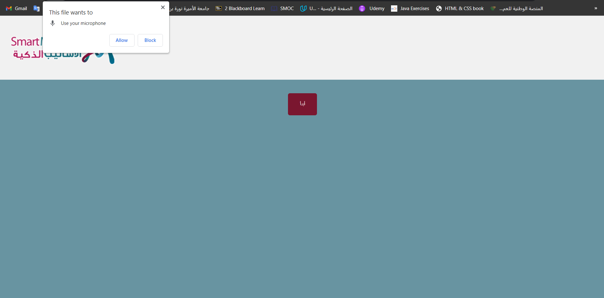
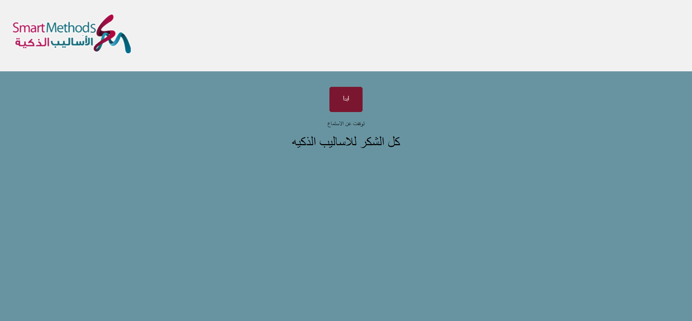

# Task 1: Arabic-Voice-Recognition

This is the first task with Smart Methods, in which I used JS to create Arabic-Voice-Recognition! 

## Screenshots

Step 1: Click on start button

Step 2: Allow the access to the mic

Step 3: Speak!! 

Step 4: We can turn your voice into text!!

# Task 2: Esp32 algorithm 
you can find it in the "algorithm" folder.
